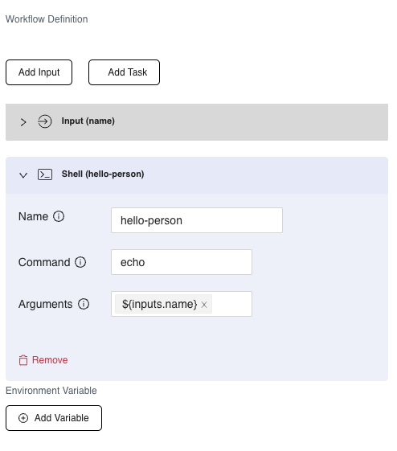
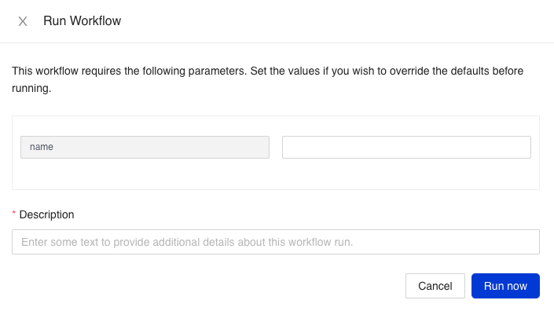
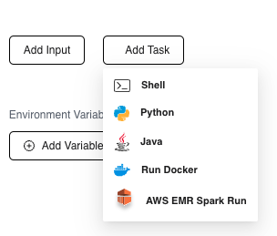
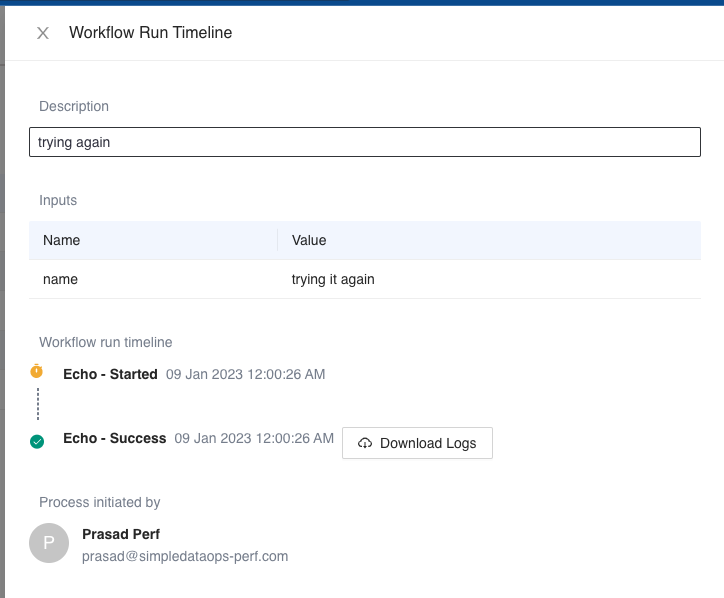

- [Cesium Automation](#cesium-automation)
- [What use cases does Cesium Automation solve?](#what-use-cases-does-cesium-automation-solve)
- [Core Concepts](#core-concepts)
  - [Deployment Model](#deployment-model)
  - [Entities](#entities)
- [Workspace](#workspace)
- [Task Executor](#task-executor)
  - [Requirements](#requirements)
  - [Installation](#installation)
  - [Running Tex](#running-tex)
  - [Downloading Tex](#downloading-tex)
- [Workflow](#workflow)
  - [Workflow Trigger Types](#workflow-trigger-types)
    - [Time based](#time-based)
    - [Workflow Trigger](#workflow-trigger)
    - [Manual Trigger](#manual-trigger)
  - [Workflow Definition](#workflow-definition)
    - [Inputs](#inputs)
    - [Tasks](#tasks)
  - [Task Types](#task-types)
    - [Shell Task](#shell-task)
    - [PythonTask](#pythontask)
    - [Run Docker](#run-docker)
- [Workflow Run History](#workflow-run-history)
    - [Workflow Run Details](#workflow-run-details)
  - [Lifecyle of a workflow run](#lifecyle-of-a-workflow-run)

# Cesium Automation

This repository documentation for Cesium Automation, a new age recurring tasks and IT workflow orchestration engine architected for the cloud.
Cesium Automation is a code workflow automation platform (as opposed to no-code or low-code workflow automation platform) that allows you to write scripts in your favorite technologies and remotely execute them inside your environment in response to various events.

## Signup and Use Cesium
You can signup and use [Cesium at this link](https://app.cesiumautomation.com/).
More information is available at our [marketing website](https://www.cesiumautomation.com/)

# What use cases does Cesium Automation solve?
Cesium Ops helps you solve 2 key problems: 
* Running recurring workflows which are supposed to run at specific time intervals.
* Running workflows for IT Service Request automation.

Examples for recurring workflows include data extraction, data movement (using FTP or S3 etc), data processing, periodic restacking, security scans etc.

Examples of IT request automation include scripts for handling things like resetting user LDAP credentials, user VPN access, granting ssh access to machines and reverting them after a set period etc. These scripts can be triggered programatically from the cloud through integrations with cloud based on service management tools like Jira.

# Core Concepts

This section explains some of the key things required to work with Cesium Ops.

## Deployment Model

Cesium Ops is designed to run in a hybrid model with the core orchestration service running as a SaaS service that is run and managed by us and a light weight daemon deployed on your infrastructure to run and track processes. This allows you to focus on using Cesium to solve key business problems while leaving the operational aspects of running the services and the database to us. The cloud component is refered to as `Cesium core`, `Cesium Cloud` or `core scheduler` in this documentation.


To run tasks and workflows inside your datacenter or cloud infrastructure, we do not require you to open any ports in your network or firewall. Cesium uses messages and queues to communicate commands and statuses across different systems.

The user needs to download a [Task Executor](#task-executor) and run it as a daemon process on any system in your infrastructure. The tasks and workflows will be executed on this machine by the task executor.


## Entities

The core entities in Cesium are:

- [Workspace](#workspace): The workspace is a way of organizing task executors and workflows
- [Task Executor](#task-executor): A piece of software that needs to be downloaded and run wherever the workflows need to be executed.
- [Workflow](#workflow): An entity which contains a directed acyclic graph of tasks where each task presents a specific step that needs to be run as an independent process and some metadata around alerting and environment varialbes.


# Workspace

The workspace is a way of organizing task executor and workflow into logical groups for easier management.
If you have multiple teams within your company using Cesium , then you can try to create a workspace per team.
Or if you are running workflows for different purposes, you can group them by purpose.

# Task Executor

The task executor (sometimes also refered to as `Tex` in the documentation) is a software that must be downloaded and run on your infrastructure. The task executor:

- runs as a daemon process within the customer's infrastructure
- is configured through a properties file to authenticate itself to the Cesium Ops cloud component.
- is responsible for executing the worfkflow and communicating the state of execution

Every task executor must be associated with a workspace. The task executor requires internet access to work correctly. The task executor initiates outbound network connections from the machine it is running on to the core scheduler in the cloud. Tex never accepts incoming requests from the internet and does not require you to open any ports in your network.

## Requirements

Following are the requirements for running Tex:
* Tex is designed to run on JRE 1.8 (any JVM > 1.8 is good enough)
* Tex does not need to be run as root.
* The JVM will consume about 512 MB of RAM but can take upto 1 GB of ram if a large number of long running workflows are being run.
* The machine where tex runs requires outbound internet action to reach Cesium Ops's cloud servers.
* Tex will not open any inbound ports on your machine and does not require changes to inbound rules on your firewall.
* Tex requires bash to be available if there are bash tasks that need to be executed
* Tex requires Python 3 and pip to be available if there are Python tasks to be executed. If tex 

## Installation

The task executor can be run on Windows or any flavor of Linux.
Here are the recommended best practices to run tex securely:
* Create a separate user in your OS just for running tex
* Unzip, setup and run task executor in a folder/path appropriate for your OS (for example `/opt/cesium/tex/` on linux)
* Make sure the folder is only accessible to the user created specifically to run tex. This ensure no other users can modify the files, read any configs specific to tex or see any sensitive information in the logs.


## Running Tex
Use the following steps to run tex:
1. Download the tex zip using the link on the download tex page
2. Optionally create a user for tex with non-super user status.
3. Unzip the contents into the location where you want to run tex like `/opt/cesium/tex`.
4. Once the contents are unzipped into a folder, we will refer to this folder as `TEX_HOME`.
5. Go to the web console of Cesium Ops and navigate to the specific task executor you are trying to run. There will be a button there to download the config file for this tex. Press it and save the file locally.
6. Under `TEX_HOME` there is a folder called config with a single config file under it called `tex-config.properties`. Update the config values from the values you get from the file you downloaded earlier.
7. You must now have a filled up config file that will look like this:

```
texId: ahasadadaasea
password: ek12this-is-a-secret-value
tenantRefId: 9abcd31l-1234-5678-1234-286dd73aec45
```
8. Start script depends on the platform.
   1. On mac and Linux: run the start script: `$TEX_HOME/bin/start-cesium-tex.sh` . This will start tex as a background process and will write out logs under the logs folder. You can safely exit the user and the shell where you started the tex instance.
   2. On Windows: run the start script: `$TEX_HOME/bin/start-cesium-tex.vbs`

## Downloading Tex

You can download tex from [this page](download-tex.md).


# Workflow

The workflow is the most important entity in Cesium.
When setting up the workflow you must input:

- workspace: The workspace inside which the workflow lives
- the task executor: The tex where the workflow will be executed. You can only associate a workflow with a tex from the same workspace.
- Trigger Type: Trigger type allows you to choose when your workflow should run. More details below.
- Code artifact: The code artifact is a zip file that contains all the files that your workflow needs. This is an optional file. If you attach a code artifact zip file, then the contents will be unzipped into the a specific folder on the machine where the task executor is running and this will be the current directory for the processes launched for the workflow.
- Workflow Definition: The workflow definition is the heart of the workflow. It is a json document that represents the acyclic graph of tasks that must be executed as part of this workflow. The [section below](#workflow-definition) describes the syntax for workflow defintion in more detail.
- Environment Variables: Cesium believes in the methodology of [the 12 factor app](https://12factor.net/codebase) where each workflow can be packaged once and run in different environments using [configs](https://12factor.net/config). You can setup environment variables to point to things like file locations, references to secrets that need to pulled in etc using environment variables. Any variables configured here will be made available to the task process as system or env variables. We strongly discourage using this to pass in secret values. We recommend storing your secrets in a system designed for them like [Vault by HashiCorp](https://www.vaultproject.io/), [AWS Secrets Manager](https://aws.amazon.com/secrets-manager/), or [GCP Secrets Manager](https://cloud.google.com/secret-manager). You can use environment variables to store the names or URI  of the secrets in these secret managers.
- Notifications: This section allows you to get alerted on specific workflow run events like Workflow Run Start, Failure or Success via email.

Once a workflow is configured, Cesium core scheduler creates a [Workflow Run](#workflow-run) and sends out commands to execute the workflow. This happens irrespective of whether the task executor is running or not.
If the task executor is running, it receives the messages and runs the specific workflow. The task executor sends periodic update on the status of the workflow run.
You can also trigger a workflow to run on demand by using the dropdown in the actions column on the workflows page.

## Workflow Trigger Types

A worfklow trigger is an event that kicks off the execution of a workflow. There are 3 main types of triggers that Cesium supports today:

### Time based

This is a workflow that is expected to run at a regular time based frequency. These workflows can be configured using a cron expression.


### Workflow Trigger

Workflows that use this trigger type are dependent on another workflow. 
When you select this option, the UI will show a dropdown containing the workflow that this workflow can be triggered by.


A workflow triggered by another workflow can be triggered in 2 modes:
* Immediate: The 2nd workflow runs immediately when the first workflow is successful.
* Delayed: The 2nd workflow runs with a delay of a configurable amount of time configured in seconds after the first workflow is successful.

### Manual Trigger
A mannually run workflow can only be triggered in 2 ways:
* A user manually invoking running the workflow from the UI
* An API integration that programatically invokes the workflow to be run.


Examples of an API integration is the Jira App from Cesium that allows you to run a workflow in response to a webhook event from Jira. Read more about it in [the Jira Integration page](jira-integration.md).

One special feature of manually triggered workflows is that they are allowed to have input variables that be added to the workflow defintion. These inputs can be passed to individual tasks in the workflow definition as variables.

## Workflow Definition

The workflow definition is the heart of the workflow. This is a Cesium specific way of representing an acyclic graph of tasks that need to be executed. The worflow definition is built using a graphical user interface.



A workflow definition is made up of 0 or more inputs and 1 or more tasks.

### Inputs
Inputs are a way to pass variables to a workflow run dynamically at the time of the worklow being triggered.
Inputs are only allowed for [manually triggered workflows](#manual-trigger).

* If the workflow is triggered manually by a human user and it requires inputs, the UI will prompt the user to enter all the inputs required by the workflow.

* If the workflow is triggered through an API integration, the GraphQL API has parameters that the caller can set to pass variables dynamically.
  If the API call contains parameters that the workflow definition does not contain, the parameters not in the definition will not be passed to the task being run.

They can be passed as values to your tasks by adding them as args using the format `${inputs[<input_name>]}` where `<input_name>` is the name given to the input.


### Tasks
A task in the workflow definition refers to a process that needs to be kicked off by tex.

A task type can one of a set of predefined types that Cesium supports. The current supported task types are:
* Shell: This is any binary or script native to the OS tex is running on (for instance sh or bash scripts on linux or mac and bat file in Windows).
* Python: Any python 3 script.
* Java: A java program packaged as a jar.
* Docker: Running a docker container
* AWS EMR Spark Job: Submitting a spark jar job to an EMR cluster running on AWS.




Each task type needs to be configured appropriately based on the configuration it requires. But there are some attributes that are common across all the task types.

Here is an explanation for each common attribute:

|      Name       |       Type     |     Meaning       |
| :-------------: | :------------: |:-------------: |
| `name` (required) |String| A descriptive name for this particular task. This will be shown in the UI in the workflow run details. Ideally this should be all small characters, with no spaces in between |
| `taskType` (required) |Enumeration| This is set when you choose the task type from the drop down |
| `dependsOn` (optional) | Multiselect dropdown | When adding multiple tasks in a workflow flow, you can define dependencies on the tasks so that they run in a specific order. If no depedency is specified, Tex might run them in any order including in parallel.|


## Task Types

The current supported task types are:

### Shell Task

This is used to run:
* sh or bash scripts on linux or mac
* any native executable available on the system
* bat script or powershell script on Windows

Attributes:
* `command`: the command that needs to be run like `cat`, `/usr/bin/backup_mysql.sh` (which is the command or the bash script that needs to be run). This can be an absolute path to a file already on the machine where tex runs or a relative path to the python script inside the code artifact zip file.
* `args`: an array of strings that are passed to the executable as parameters. After each parameter, hit "enter" to add the stirng to the argument.

### PythonTask

This task type is used to run python scripts. Tex currently only supports running python3 scripts. If your task requires specific python libraries, you can define a `requirements.txt` in the code artifact zip file which lists all dependencies in the standard format.
Tex will create a virtual env for this workflow which live inside the workflow folder. The virtual env will be activated each time this task needs to be executed.

The attributes of a python task are: 
* `script` (Required): The script to the python script that needs to be executed. This can be an absolute path to a file already on the machine where tex runs or a relative path to the python script inside the code artifact zip file.
* `args` (optional): an array of strings that are passed to the bash script as parameters.

Requirements:
* The system where tex is running must have python3 installed and available as `python` on Windows and `python3` on *nix. 
* If you are using a `requirements.txt` to manage dependencies, `pip3` and `venv` must be available.
  

### Run Docker

Docker is a containerization technology. Using this task type you can run any docker image.
The attributes required to configure a docker run are:
* Docker Image (required): The image that needs to be run. This can be an image from docker-hub or from any private container registry. If its from a private container registry like ECR, please add the fully qualified image name.
* Commands (optional): If you want to override the process that the docker container to run. If this is kept empty, then the default RUN command is executed.
* Arguments (optional): If you need to pass any optional arguments or parameters to the docker image.

Requirements:
* Docker daemon must be running on the same machine where the tex is running. On linux, tex will communicate to the docker daemon using the standard socket and on Windows using the docker REST API available on the standard port locally. Running docker containers on remote machines is not supported.
* Authentication to container registry: There is no explicit authentication and authorization configured to talk to the a private container registry if one is being used. Refer to [Docker login](https://docs.docker.com/engine/reference/commandline/login/) on how to provide login credentials. Most private container registries like AWS ECR, Google Container Registry/Artifact registry also provide instructions on how to use their respective IAM mechanims to allow your instance to pull images from the registry. Please refer to your vendor provided instructions for authenticating the docker daemon to your container registry.


# Workflow Run History

A workflow refers to a single run of the workflow. A workflow run is created whenever it is time to execute it (based on the configured cron) or it is executed on demand.
Each workflow run will have the following attributes:

- Requested time: The time at which the workflow run was initiated (whether automatic or manual)
- Start time: The time at which the workflow execution was started by tex
- End time: The time at which the last task in the workflow finished execution
- Status: The current status of the task.
- Execution Type: An enumeration of whether it was scheduled or an on-demand execution.

You can view the workflow run of a specific workflow by choosing the `View History` action in the workflows list or by clicking on the `View History` button on the details of a specific workflow.

### Workflow Run Details
In workflow history, you can click on any row to see the details of a specific workflow run. 
The workflow run should show you the following details:
* Run Description
* Inputs
* Workflow Run Timeline: A timeline of individual tasks lifecycle
* Details of the user or the process that started the workflow. If the workflow was started due to a dependency on another workflow, it will show the id or the name of the other workflow.



## Lifecyle of a workflow run

A workflow run goes through the following lifecycle:

- Requested: The workflow run has been scheduled and a request has been sent to `tex` to execute it.
- Started: The workflow execution has been started by tex.
- Failed: The workflow execution failed due to an error.
- Succeeded: The workflow execution completed successfully.
- Expired: If a workflow is not pickedup for execution with 4 hours for any reason (like tex being down), the worklfow is marked as `Expired` and is not pickedup for execution. 
